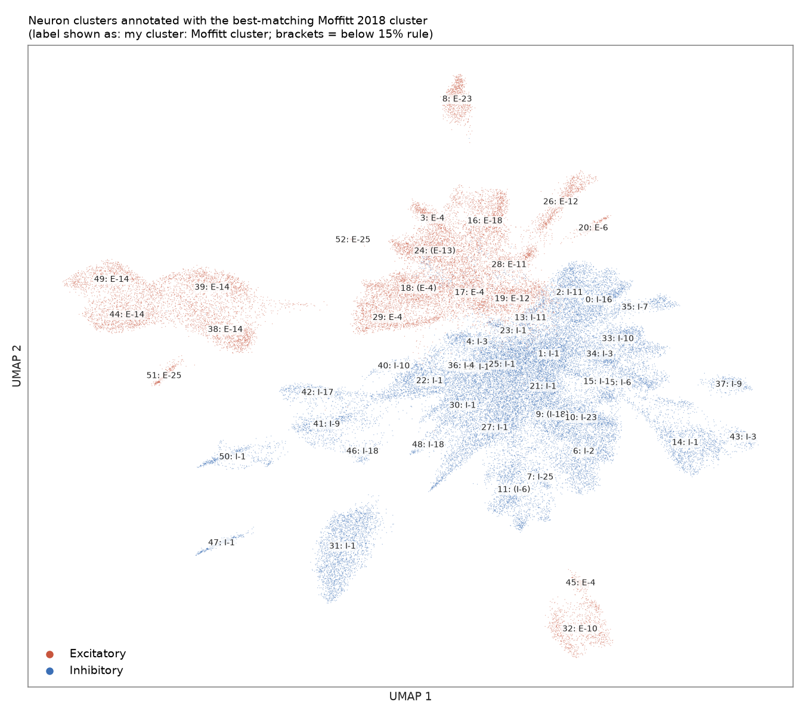
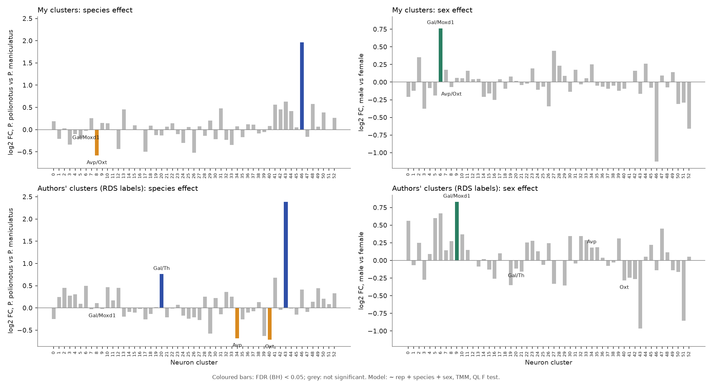
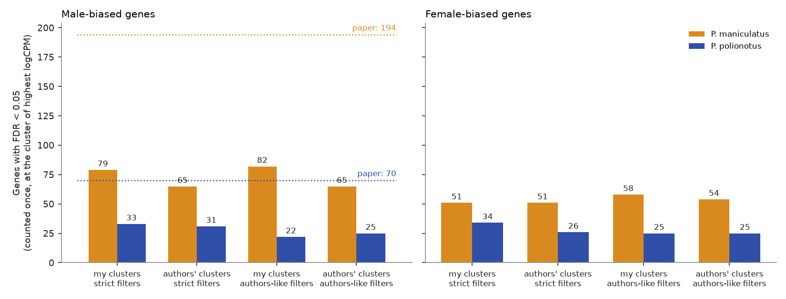
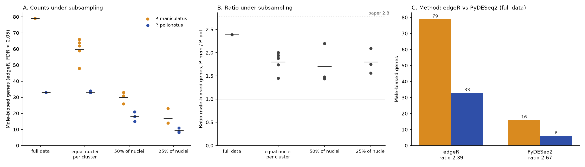

# peroPOA_snRNAseq

Independent reanalysis of the preoptic area (POA) single-nucleus RNA-seq atlas of *Peromyscus maniculatus* and *Peromyscus polionotus* from Chen et al. (eLife 2025, GEO [GSE272719](https://www.ncbi.nlm.nih.gov/geo/query/acc.cgi?acc=GSE272719)). The pipeline rebuilds the neuron clusters from raw counts, compares them with the published labels, maps them to the mouse POA reference of Moffitt et al. (Science 2018), and tests species and sex effects on cell type abundance and gene expression. This project is not affiliated with the original authors.

## Key results

| | |
|---|---|
| Nuclei analysed | 95,057 (6 replicates, 2 species, 2 sexes), 52,750 neurons in 53 clusters |
| Agreement with the authors' neuron clusters | ARI 0.54, NMI 0.73; 42 of 53 clusters have at least 50% of nuclei in a single published cluster (median 0.79) |
| Mouse reference mapping | Held-out accuracy 0.73 (inhibitory) and 0.81 (excitatory); 49 of 53 clusters carry at least one Moffitt label at the 15% threshold |
| Differential abundance (edgeR) | With the authors' labels, 4 clusters differ between species at FDR < 0.05 (20 and 43 higher in *P. polionotus*, 34 and 40 lower); one cluster differs by sex |
| Sex-biased genes | More male-biased genes in *P. maniculatus* than in *P. polionotus* under every setting tested, but absolute counts are below the published 194 and 70 |
| Robustness of that difference | Ratio of male-biased genes (*P. man* / *P. pol*) between 1.4 and 2.7 across subsampling schemes and across edgeR and PyDESeq2; published ratio is 2.8 |









Further figures (QC, integration, comparison with published clusters, marker dot plot) are in `figures/supplemental/`.

## Pipeline

Run from the repository root with `bash scripts/run_pipeline.sh`. Steps in order:

| Step | Script | Main inputs | Main outputs |
|---|---|---|---|
| Export published metadata | `export_author_metadata.R` | `neurons.clustered.rds` | author cluster labels, shared gene list |
| Load and QC | `preprocess_qc.py` | GEO count matrices | per-species AnnData, QC tables, doublet scores |
| Integrate and cluster | `cluster_nuclei.py` | AnnData files | cell classes, 53 neuron clusters, excitatory/inhibitory calls |
| Annotate | `annotate_clusters.py` | neuron clusters, published labels, Moffitt MERFISH table | cluster comparison, Moffitt labels |
| Pseudobulk | `pseudobulk.py` | raw neuron counts | cluster by animal count matrices, subsampled versions |
| Differential abundance | `differential_abundance.R` | cluster by animal counts | `results/differential_abundance_edger.csv` |
| Sex-biased expression | `sex_de_edger.R` | pseudobulk matrices | `results/sex_de_*.csv`, `results/robustness/` |
| Method check | `sex_de_pydeseq2.py` | pseudobulk matrices | `results/robustness/pydeseq2_*.csv` |
| Figures | `make_figures.py` | tables in `results/` | `figures/` |

`results/` holds the final tables. Per-nucleus intermediates are written to `data/` and are not tracked.

## Data

Nothing in `data/` is redistributed. To reproduce the analysis, place the following there:

1. From GEO GSE272719: the six per-replicate count matrices, barcode, feature and demultiplexing files (into `data/raw/`), the `Pman` and `Ppol` gene name tables, and `GSE272719_neurons.clustered.rds`.
2. The MERFISH cell table from Moffitt et al. 2018, saved as `data/moffitt_merfish.csv`.

## Installation

```
conda env create -f environment.yml
conda activate peropoa
```

The R scripts need R 4.x with Seurat, edgeR and Matrix.

## Analysis details

- **Gene space.** Genes are matched between species by their mouse-style names, giving 30,704 shared genes, the same set as the published object.
- **Integration.** Harmony with replicate and species as batch variables. Neurons are reclustered with highly variable genes selected per species. The Leiden resolution was chosen so that the number of clusters (53) matches the published analysis.
- **Doublets.** Scrublet scores are computed per animal and flagged. Flagged nuclei are kept.
- **Differential abundance.** Nuclei counts per cluster and animal are modelled with edgeR (`~ rep + species + sex`, TMM, quasi-likelihood F test). Both Benjamini-Hochberg and Holm adjustments are reported, since the authors' notebook used Holm.
- **Sex-biased expression.** Counts are summed per cluster and animal, and edgeR (`~ rep + sex`) is run within each species and cluster. Two filter settings are provided: `strict` (at least 10 nuclei per pseudobulk sample and `filterByExpr`) and `authorlike` (any sample with at least one nucleus, only all-zero genes removed). A gene significant in several clusters is counted once, in the cluster with the highest logCPM.
- **Robustness.** Pseudobulk sets were rebuilt after (a) equalising nuclei per cluster between species, (b) keeping a random 50% of nuclei and (c) keeping 25%, with several draws each, and the test was repeated with PyDESeq2.
- **Mouse reference.** Excitatory and inhibitory neurons are mapped separately to naive-animal MERFISH neurons with scanpy `ingest` on the shared genes. A cluster receives a Moffitt label when at least 15% of its nuclei carry it.

## Limitations and next steps

- Clusters are not identical to the published ones, and the absolute number of sex-biased genes is lower than reported (79 and 33 here against 194 and 70 under the strict setting). The direction and approximate ratio agree.
- Each species and sex has 6 animals, so tests on clusters with few nuclei are underpowered.
- The 15% labelling rule leaves 4 clusters without a mouse label and 19 with more than one.
- Next: expression of neuropeptides and their receptors by cluster, and a comparison with the sex-biased genes reported for the mouse POA.
